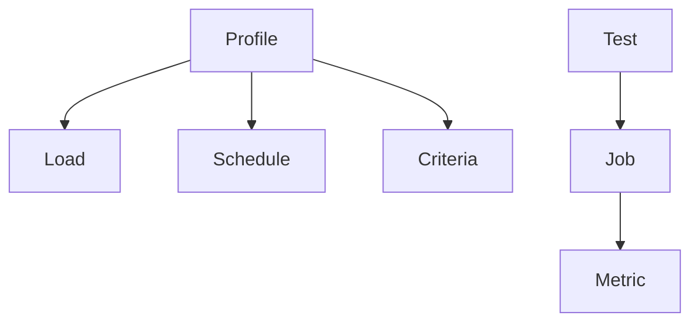
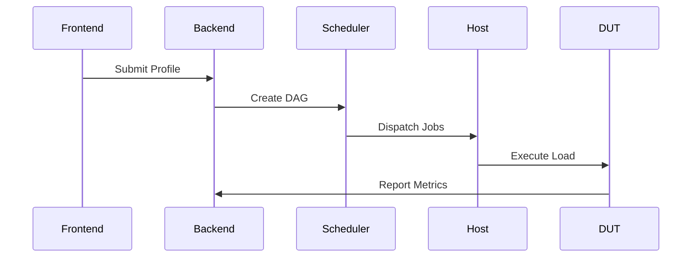

# TSHRAG Testing Framework Overview

## Project Introduction
**Project Name**: `Tshrag` (Test SHelling, Resourcing, Assigning, Grouping)  
**Current Version**: `v0.0.0` (from `tshrag/global.py`)

## Core Architecture

### 1. Key Concepts
```text
Profile → Test → Job → Metric
Load → Schedule → Criteria
```

### 2. Component Hierarchy


## Key Features

### 1. Profile-Driven Testing
```json profile_example.json
// Example test configuration
{
  "name": "network_stress_test",
  "loads": {
    "traffic_gen": {
      "path": "git@repo:tools/iperf-module.git#v3.1"
    }
  },
  "schedule": {
    "sequence": [
      {
        "load": "traffic_gen",
        "params": { "duration": 600 }
      }
    ]
  },
  "criteria": {
    "latency": {
      "metric": "network::latency::avg",
      "max": "150ms"
    }
  }
}
```

### 2. Job Execution Context
```text file_structure
jobs/
└─ JID_001/
   ├─ load_bin         // Executable from cache
   ├─ input_params.json
   └─ metrics/
      └─ network::latency.csv
```

### 3. Metric Collection
- **Format**: CSV with timestamp-value pairs
- **Storage**: Hierarchical storage strategy
  - Hot data: Prometheus (7 days)
  - Cold data: Compressed in S3

## System Workflow

### Execution Pipeline
1. Profile submission
2. Dependency resolution
3. Job DAG generation
4. Load deployment
5. Metric collection
6. Criteria evaluation



## Design Challenges

| Challenge | Solution |
|-----------|----------|
| Version Consistency | SHA256-based caching |
| Cross-platform Execution | Load manifest declaration |
| Metric Conflicts | Namespace isolation |
| Large-scale Storage | Hot/Cold data separation |

## Appendix

### Environment Configuration
(from `tshrag/global.py`)
```python
# Environment Variables
ENV_PREFIX = "TSHRAG_"
ENV_CACHE = "TSHRAG_CACHE"
ENV_STORE = "TSHRAG_STORE"
```

### API Example
(from `test_deepseek.py`)
```python test_deepseek.py
client = OpenAI(
    api_key="sk-...",
    base_url="https://api.deepseek.com"
)
response = client.chat.completions.create(
    model="deepseek-chat",
    messages=[...]
)
```

---
> This document references implementation details from provided source files. For complete system documentation, see related design specs in `tshrag/rpopen/__init__.py` for process execution implementation.