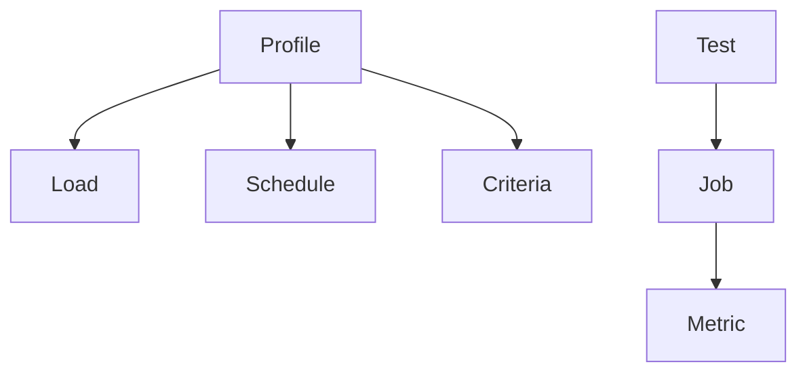
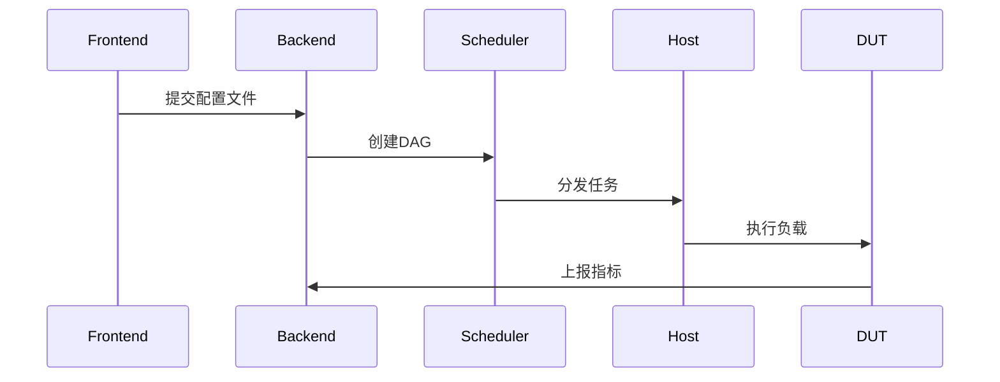

# TSHRAG 测试框架概述

> 本文档为英文版（`0.Overview.md`）的翻译版本，如有歧义以英文原版为准

## 项目简介
**项目名称**: `Tshrag` (Test SHelling, Resourcing, Assigning, Grouping)  
**当前版本**: `v0.0.0` (定义于 `tshrag/global.py`)

## 核心架构

### 1. 关键概念
```text
Profile → Test → Job → Metric
Load → Schedule → Criteria
```

### 2. 组件层级


## 核心特性

### 1. 基于配置的测试驱动
```json profile_example.json
// 测试配置示例
{
  "name": "network_stress_test",
  "loads": {
    "traffic_gen": {
      "path": "git@repo:tools/iperf-module.git#v3.1"
    }
  },
  "schedule": {
    "sequence": [
      {
        "load": "traffic_gen",
        "params": { "duration": 600 }
      }
    ]
  },
  "criteria": {
    "latency": {
      "metric": "network::latency::avg",
      "max": "150ms"
    }
  }
}
```

### 2. 任务执行上下文
```text file_structure
jobs/
└─ JID_001/
   ├─ load_bin         // 缓存中的可执行文件
   ├─ input_params.json
   └─ metrics/
      └─ network::latency.csv
```

### 3. 指标收集
- **格式**: 带时间戳-数值对的CSV
- **存储**: 分层存储策略
  - 热数据: Prometheus (7天)
  - 冷数据: S3压缩存储

## 系统工作流

### 执行流水线
1. 提交配置文件
2. 依赖解析
3. 生成任务DAG
4. 部署负载
5. 收集指标
6. 标准评估



## 设计挑战

| 挑战 | 解决方案 |
|-----------|----------|
| 版本一致性 | 基于SHA256的缓存机制 |
| 跨平台执行 | 负载清单声明 |
| 指标冲突 | 命名空间隔离 |
| 大规模存储 | 热/冷数据分离 |

## 附录

### 环境配置
(来自 `tshrag/global.py`)
```python
# 环境变量
ENV_PREFIX = "TSHRAG_"
ENV_CACHE = "TSHRAG_CACHE"
ENV_STORE = "TSHRAG_STORE"
```

### API 示例
(来自 `test_deepseek.py`)
```python test_deepseek.py
client = OpenAI(
    api_key="sk-...",
    base_url="https://api.deepseek.com"
)
response = client.chat.completions.create(
    model="deepseek-chat",
    messages=[...]
)
```

---
> 本文档引用自源码实现，完整系统设计请参考 `tshrag/rpopen/__init__.py` 中的进程执行实现。